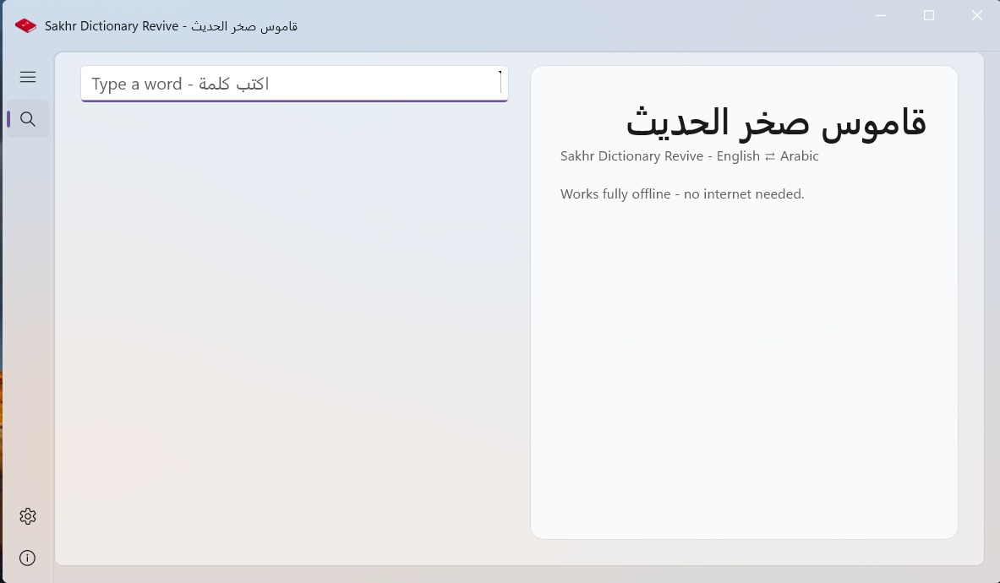
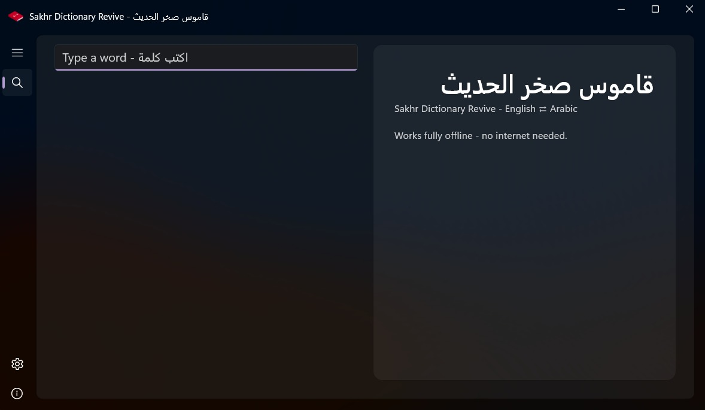
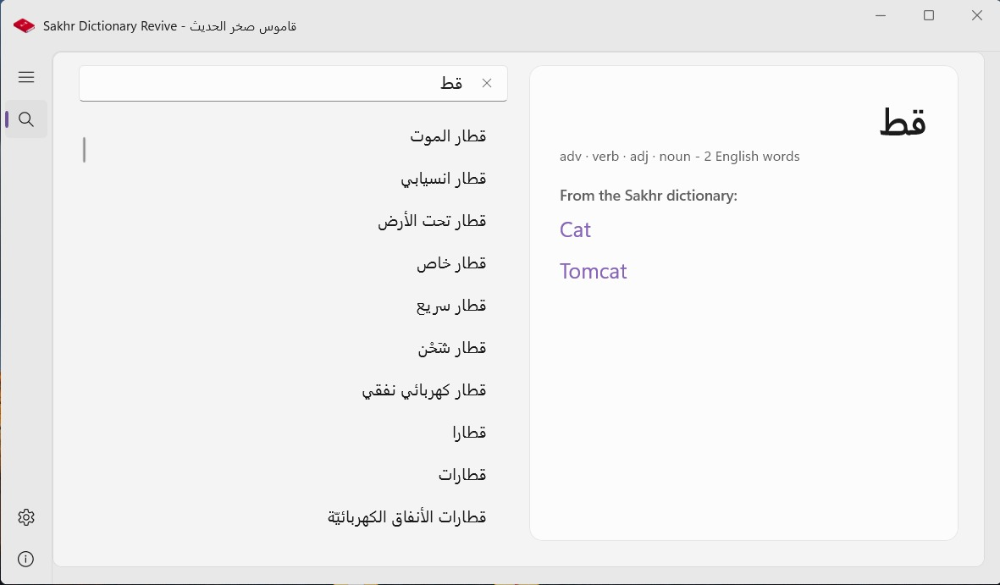
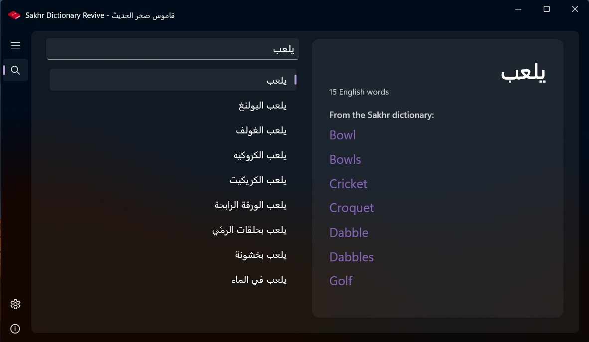
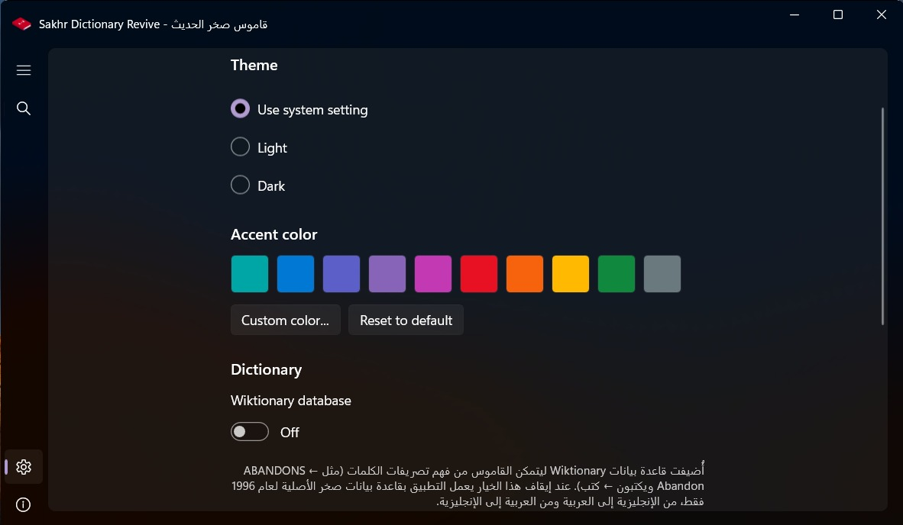

# Sakhr Dictionary Revive

The classic Sakhr Dictionary reborn as a modern Windows app.
[النسخة العربية](README.md)

## The story

In 1996, Sakhr released the Sakhr Dictionary for Windows, the successor of
an even older 1987 edition for MSX Al-Alamiah machines. Whole generations
across the Arab world grew up with it; for many of us it was the first
electronic dictionary we ever knew.

Today the dictionary comes back to life as a modern Windows app. It carries
the complete original data, extracted from the user's own copy of the 1996
program, and presents it in a native WinUI 3 (Fluent) interface, with new
capabilities the original program never had.

## Features

- **Fully offline**: both databases ship inside the app, so every search
  happens right on your device. The app never needs the internet, except
  if you press the update check button in Settings.
- **Instant search in both directions**: English -> Arabic and
  Arabic -> English, from the very first letter.
- **The complete original data**: 59,427 English lemmas and 125,896 Arabic
  meanings from the 1996 Sakhr dictionary, with Arabic diacritics rendered
  correctly (something the original program itself could not do).
- **Inflection redirect in both languages**: type an inflected form such as
  ABANDONS, or a conjugated Arabic verb or plural, and the app takes you
  straight to the base entry with a note naming the form
  (ABANDONS <- ABANDON).
- **Wiktionary Arabic data**: 36,627 Arabic entries from English
  Wiktionary. Their meanings appear first, with the Sakhr translation
  below in its own clearly labeled section - the two sources never mix.
- **Native modern interface**: Fluent design with a Mica backdrop, light
  and dark themes, and full right-to-left Arabic support.
- **Your accent color**: the default is teal (#00A6A6); pick any color you
  like in Settings.
- **Manual updates**: the app never checks for updates on its own - one
  button in Settings checks when you ask it to.
- **Optional Wiktionary database**: a Settings toggle turns the Wiktionary
  database off, leaving the app on the original Sakhr database alone,
  English to Arabic and back. When it is on, the dictionary
  understands word inflections and adds Wiktionary meanings to Arabic search.

## Screenshots

| Home - light | Home - dark |
| --- | --- |
|  |  |

| Arabic search - light | Arabic search - dark |
| --- | --- |
|  |  |

| English inflection redirect | Arabic inflection redirect |
| --- | --- |
|  |  |

| Settings |
| --- |
|  |

## Download

From the
[Releases](https://github.com/MohamedElnaggar00/Sakhr-Dictionary-Revive/releases)
page:

- **Full installer** (recommended): includes everything needed to run.
- **Portable zip**: runs directly with no installation.
- **Small installer**: requires .NET 8 on the machine.

## The original

The box of the original **Sakhr Dictionary, MSX Al-Alamiah edition (1987)** -
the ancestor of the 1996 Windows version this project revives, and the
dictionary whole generations grew up with. Photos from the developer's own
copy.

| Front | Back |
| --- | --- |
|  |  |

## The data

`data/dictionary.jsonl` holds the full extracted dataset: 59,427 records
aligned 1:1 with the original program's English word list, with the Arabic
meanings captured from the 1996 program itself. 45,693 lemmas resolve to
meanings; the rest are rare inflections and proper nouns absent from the
original program's own search index. The original program lives on
untouched in `data/legacy/sakhr.7z`.

- **English -> Arabic:** the original 1996 Sakhr dictionary data,
  extracted from the user's own copy.
- **Arabic -> English and the inflection tables:** Arabic entries and
  form-of relations from English Wiktionary, machine-extracted by
  wiktextract and published at
  [kaikki.org](https://kaikki.org/dictionary/Arabic/), licensed
  [CC BY-SA 4.0](https://creativecommons.org/licenses/by-sa/4.0/) (see
  `data/LICENSE-wiktionary-ar.txt`).

The application source code is MIT licensed; the Wiktionary-derived data
ships under CC BY-SA 4.0 with attribution.

## Build from source

```
dotnet publish src/FluentSakhrDictionary/FluentSakhrDictionary.csproj -c Release -r win-x64
```

Requires .NET 8 SDK and the Windows App SDK 1.6 workload. The app runs
framework-dependent: the Windows App Runtime installer is bundled in the
setup.

## About the Developers

Developer: Mohamed Elnaggar

Contributors: app.instinct

[brought to you by Instinct](https://instinct.com)

## License

MIT
