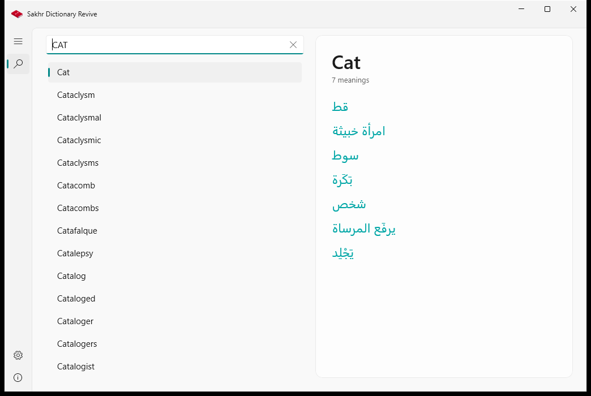
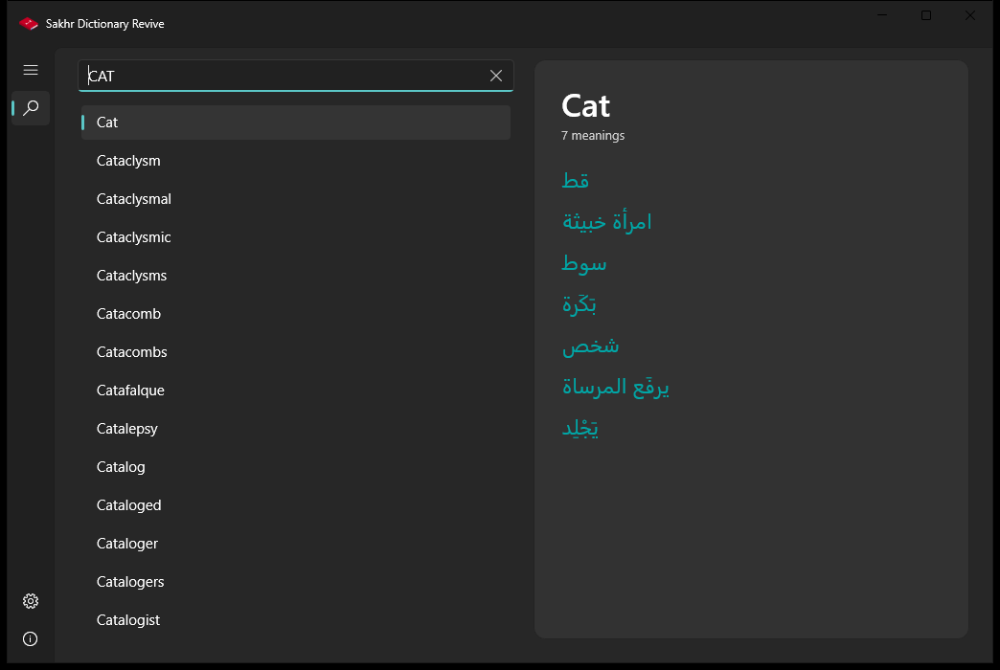
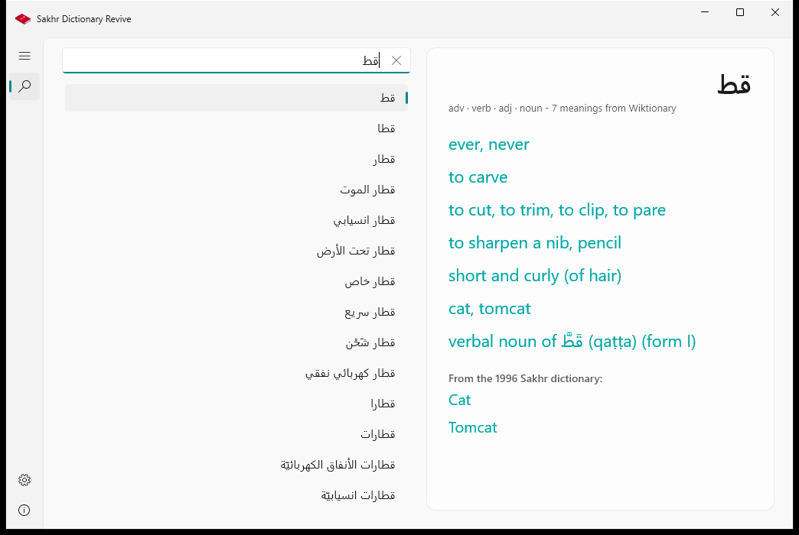
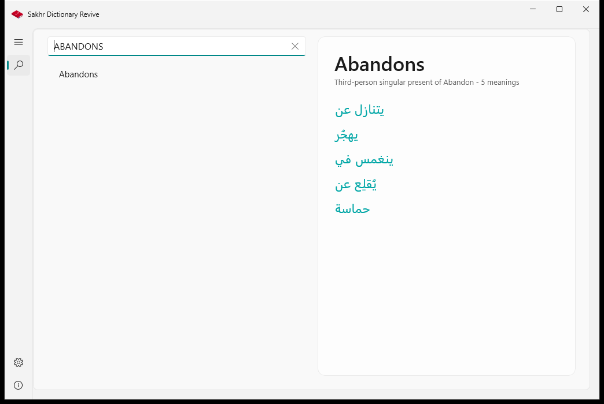
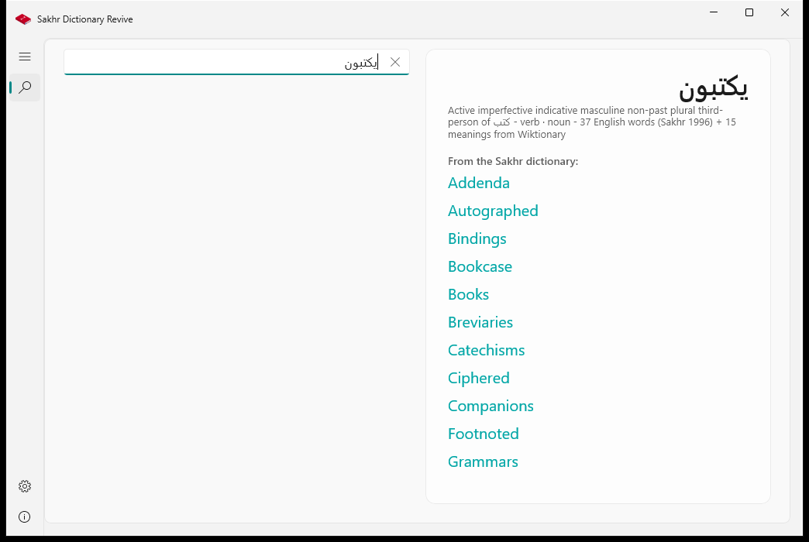
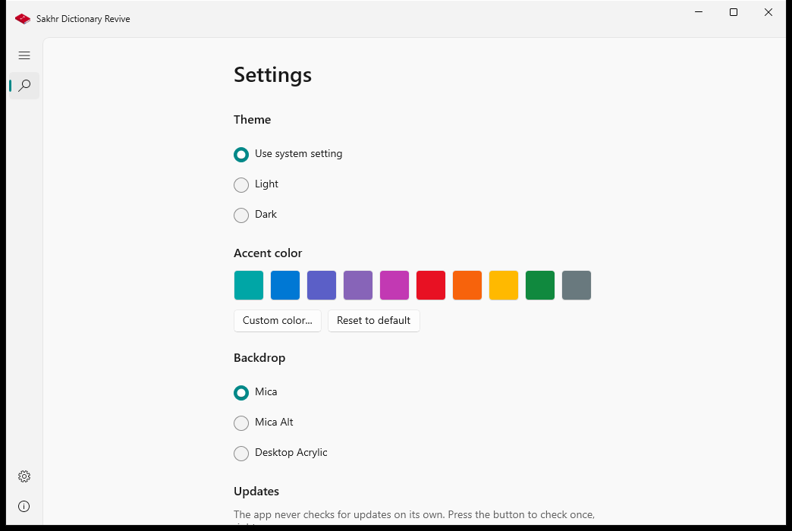
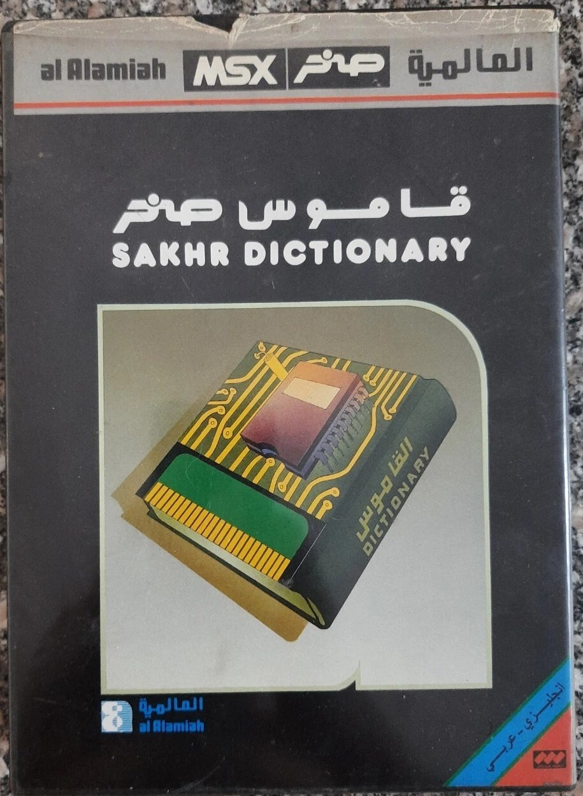
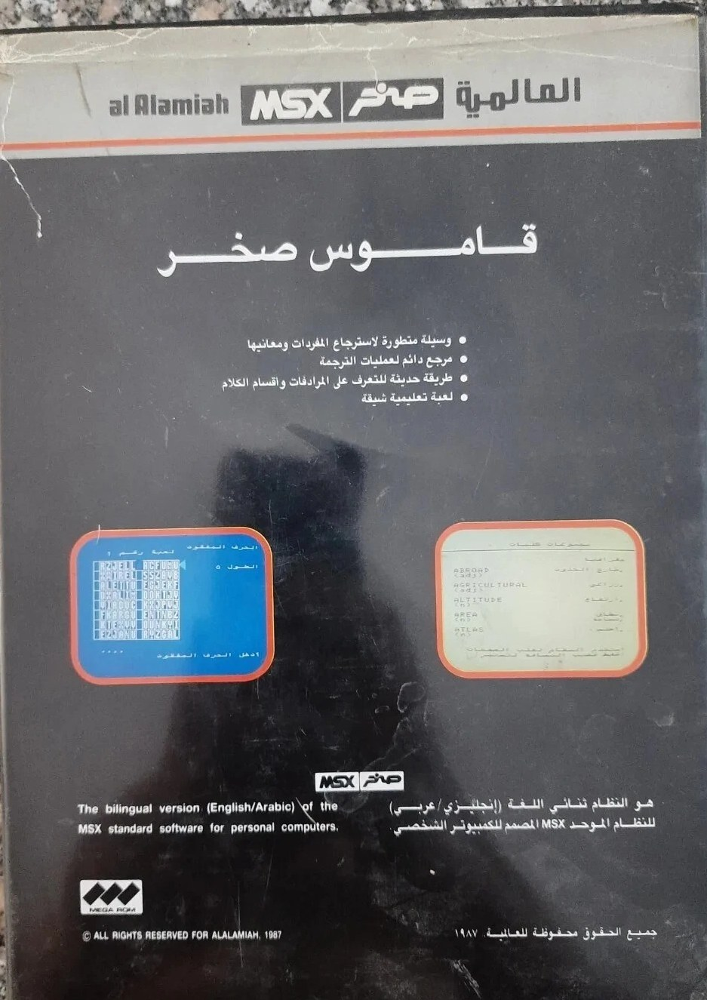

<p dir="rtl" align="right"><b>قاموس صخر الحديث</b></p>
<p dir="rtl" align="right">تطبيق قاموس صخر - إعادة احياء لبرنامج قاموس صخر الأصلي الصادر سنة 1996</p>
<p dir="rtl" align="right"><a href="README.en.md">English version</a></p>

<div dir="rtl">

## القصة

عام 1996 أصدرت شركة صخر برنامج قاموس صخر لأجهزة ويندوز، وكان امتدادًا لنسخة
أقدم صدرت عام 1987 على أجهزة MSX العالمية، فتربّت عليه أجيال كاملة وهو
القاموس الإلكتروني الأول الذي عرفه كثيرون منا في العالم العربي.

اليوم يعود القاموس من جديد في تطبيق حديث لنظام ويندوز، يحمل البيانات
الأصلية كاملة كما استُخرجت من النسخة الأصلية للبرنامج، ويقدّمها بواجهة
عصرية أصلية (WinUI 3) بتصميم Fluent، مع إمكانيات جديدة لم تكن موجودة في
البرنامج الأصلي.

## المميزات

- **بحث فوري في الاتجاهين**: من الإنجليزية إلى العربية ومن العربية إلى
  الإنجليزية، بمجرد كتابة أول حرف، ودون الحاجة إلى اتصال بالإنترنت.
- **البيانات الأصلية كاملة**: 59,427 مدخلة إنجليزية و125,896 معنى عربيًا
  من بيانات قاموس صخر الصادر سنة 1996، مع عرض التشكيل العربي عرضًا سليمًا
  (وهو ما عجز عنه البرنامج الأصلي نفسه).
- **تحويل الصيغ إلى أصولها في اللغتين**: إذا كتبت صيغة مشتقة مثل
  ABANDONS أو فعلًا عربيًا متصرفًا أو جمعًا، يعرض التطبيق المدخلة الأصلية
  مباشرة مع بيان نوع الصيغة (ABANDONS ← ABANDON).
- **قاعدة Wiktionary العربية**: 36,627 مدخلة عربية من قاموس Wiktionary
  الإنجليزي، تعرض معانيها أولًا ثم ترجمة قاموس صخر تحتها في قسم منفصل
  بعنوان واضح، فلا تختلط المصادر أبدًا.
- **واجهة أصلية حديثة**: تصميم Fluent بخلفية Mica، وسمة فاتحة وداكنة،
  ودعم كامل للغة العربية واتجاهها من اليمين إلى اليسار.
- **لون مميز حسب ذوقك**: اللون الافتراضي فيروزي (#00A6A6)، ويمكن اختيار
  لون آخر من صفحة الإعدادات.
- **تحديثات يدوية**: لا يتحقق التطبيق من التحديثات من تلقاء نفسه؛ زر واحد
  في الإعدادات يكفي للتحقق عندما تشاء.
- **قاعدة Wiktionary اختيارية**: من الإعدادات يمكن إيقاف قاعدة بيانات Wiktionary
  فيعمل التطبيق بقاعدة صخر الأصلية وحدها، من الإنجليزية إلى العربية والعكس.
  عند تفعيلها (الوضع الافتراضي) يفهم القاموس تصريفات الكلمات ويضيف معاني
  Wiktionary للبحث العربي.

## لقطات من التطبيق

| الواجهة الفاتحة | الواجهة الداكنة |
| --- | --- |
|  |  |

| البحث من العربية إلى الإنجليزية | تحويل الصيغ الإنجليزية |
| --- | --- |
|  |  |

| تحويل الصيغ العربية | صفحة الإعدادات |
| --- | --- |
|  |  |

## التحميل

من صفحة
[الإصدارات](https://github.com/MohamedElnaggar00/Sakhr-Dictionary-Revive/releases)
اختر ما يناسبك:

- **المثبّت الكامل** (يُنصح به): يشمل كل ما يحتاجه التشغيل.
- **النسخة المحمولة**: ملف مضغوط يعمل مباشرة دون تثبيت.
- **مثبّت خفيف**: يتطلب وجود .NET 8 على الجهاز.

## الأصل العتيق

علبة **قاموس صخر الأصلي، نسخة MSX العالمية (1987)**، وهي الجد الأقدم لنسخة
ويندوز الصادرة سنة 1996 التي يحييها هذا المشروع، والقاموس الذي تربّت عليه
أجيال صغيرة. الصورتان من نسخة المطوّر الخاصة.

| الواجهة | الخلف |
| --- | --- |
|  |  |

## البيانات

يحتفظ الملف `data/dictionary.jsonl` بمجموعة البيانات كاملة: 59,427 سجلًا
مطابقًا لقائمة الكلمات في البرنامج الأصلي، وقد التُقطت معانيها العربية من
البرنامج الصادر سنة 1996 نفسه. يوجد منها 45,693 مدخلة بمعانٍ، أما الباقي
فهو صيغ نادرة وأعلام لم تكن موجودة في فهرس بحث البرنامج الأصلي ذاته. وما
زال البرنامج الأصلي محفوظًا كما هو في `data/legacy/sakhr.7z`.

- **من الإنجليزية إلى العربية**: بيانات قاموس صخر الأصلي (1996)،
  استُخرجت من نسخة المستخدم الخاصة.
- **من العربية إلى الإنجليزية وجداول تحويل الصيغ**: من قاموس Wiktionary
  الإنجليزي، استخرجها مشروع wiktextract ونشرها على
  [kaikki.org](https://kaikki.org/dictionary/Arabic/)، بترخيص
  [CC BY-SA 4.0](https://creativecommons.org/licenses/by-sa/4.0/)
  (انظر `data/LICENSE-wiktionary-ar.txt`).

شفرة التطبيق مرخصة برخصة MIT، أما البيانات المشتقة من Wiktionary فتخضع
لترخيص CC BY-SA 4.0 مع نسب المصدر.

## البناء من المصدر

```
dotnet publish src/FluentSakhrDictionary/FluentSakhrDictionary.csproj -c Release -r win-x64
```

يتطلب الأمر .NET 8 SDK وحزمة Windows App SDK 1.6. يعمل التطبيق بنمط
framework-dependent، ومثبّت Windows App Runtime مضمّن في ملف التثبيت.

## عن المطورون

المطوّر: محمد النجار

المساهمون: app.instinct

[brought to you by Instinct](https://instinct.com)

## الرخصة

MIT

</div>
